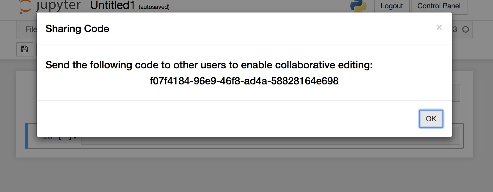
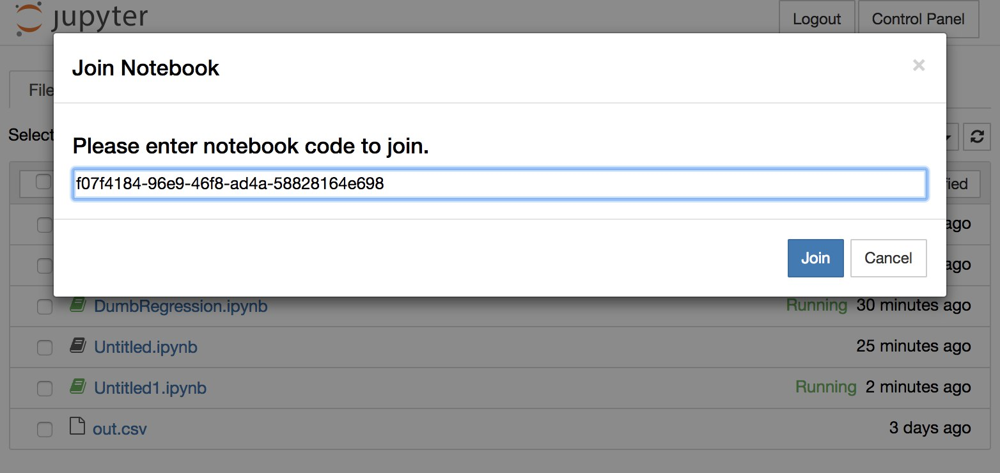
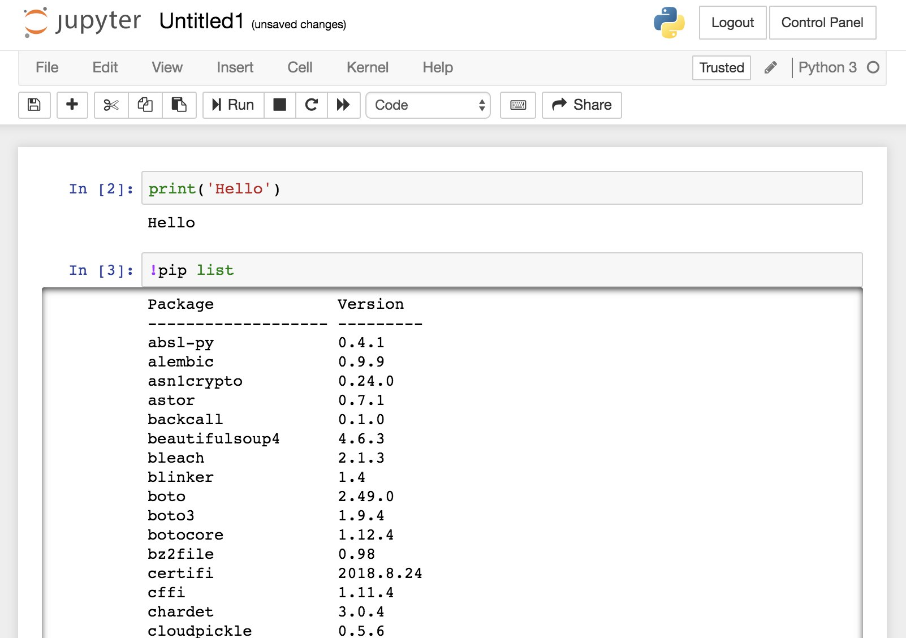

### Setup Study Environment

- Make sure Chrome is installed on your computer
- Please turn on the Lookback extension for [session1](https://participate.lookback.io/wFEBKK?live) and wait for the research team to join

### How to Use Experimentor


##### Share a Notebook
1. Sign in [Experimentor](https://experimentorx.mentoracademy.org) with your Coursera account.

2. Open the `Problem Statement.ipynb` in `Problem-Statement-Folder` folder.

3. Click the "Share" button. Experimentor will give you a code.

    

##### Join a Notebook

- To join a notebook, click the "Join Notebook" button on the homepage and paste the code.

    

##### Install Python Packages

- There are some common packages installed in Experimentor. To check them, open a notebook and type the following:

    

- If the package you need is not on this list, you could install by typing:

    ```
    !pip install __packageX__
    ```

##### What if the notebook is not working?

Since Experimentor is still a research prototype, it might run into issues. If the Python code in your notebook is not working, please try to restart the kernel. If it doesn't work out, or you experience other issues, please contact Anant via Slack or email.


### Goal for Session 1

In this session, your group will use concepts such as feature engineering to solve the predictive modeling problem at hand.

### Submission

Please submit your files [here](https://goo.gl/forms/GEkrwYZK6rJdHJvG3).

Please submit a Jupyter Notebook file (.ipynb) which documents all the steps you have tried in each session, with executable codes and textual explanations of what works, what does not work. The notebook shoud be clear and instuctive enough that a novice data scientist could walk through, run the code and understand your work.


### After Session 1

- Please fill this [diary](https://umich.qualtrics.com/jfe/form/SV_3aPb6f7nmjBweeF) (roughly 5 mins to finish) for we to collect feedbacks from your collaboration experience.
